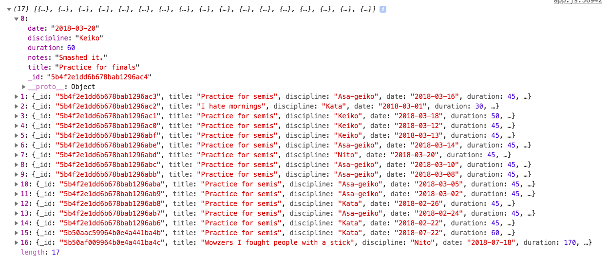
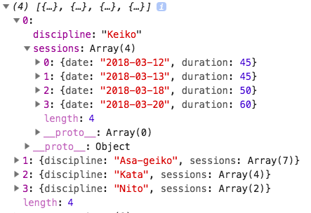
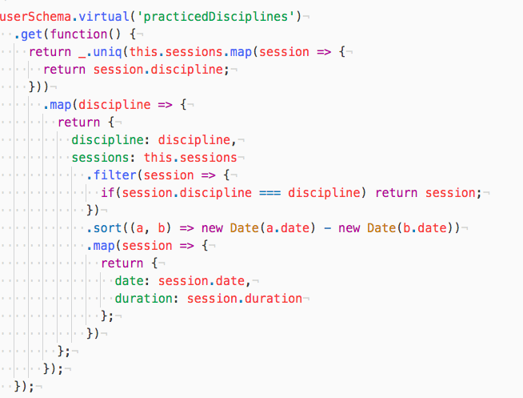

####Overcoming problems
One of the problems we had when working with Chart.js was the data needed to be delivered to it in a very specific way in order for it to be rendered in Chart.js. The main problem we had with this was how we were storing our data in the model. Inside the user model was an embedded sessions schema to record every session, creating a large array with objects of every session recorded.

This meant that in order to render the data accurately in the way Chart.js wanted there was a chain of functions on the front-end manipulating this data in order to format it properly. However, with the help of lodash, we were able to move a lot of the logic that went in to these functions to the backend and have the model deliver a virtual with the data better formatted.

This was really useful as it also meant later in the project when we wanted to use a different type of chart we already had the data in a more useful format and so the logic to render it in a different chart wasn't difficult to write.

###Coding Journey

#####3rd Party Components
We used both Chart.js and React-Timeline for the project and the implementation was difficult. We struggled initially to get something from Chart.js on the page and so we moved on to another feature, which was the timeline. Implementation of the timeline was quite simple and gave us a quick win on the day as we had been struggling with Charts for a while it was nice to be able to get this feature to work.

#####Back End
Initially we had intended to have the Sessions schema embedded. However we ran in to some problems with working on out how to update the array in Mongoose so briefly we moved the sessions to their own Model. This made it simpiler for updating sessions however it would mean that if a user deleted themselves their sessions would remain. We were able to tidy this code up and move the logic back into the User model and embed the schema.