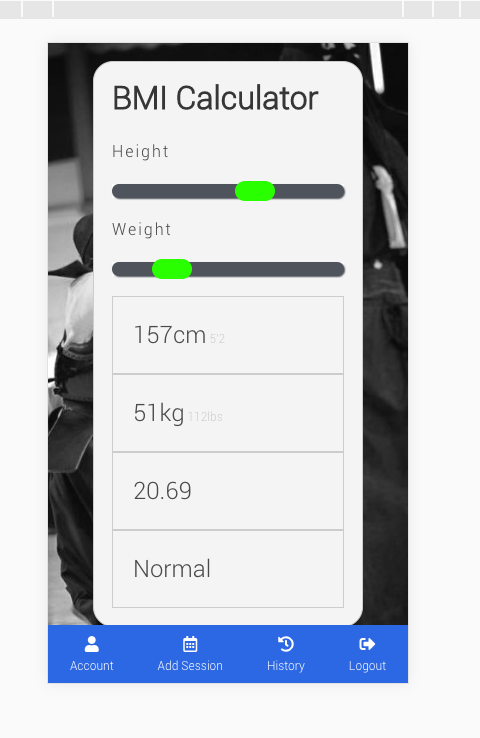

# GA WDI-34  Project #4: A MERN stack Application (Pair Project)
## 'kendo.io'

[Heroku Link](https://kendo-io.herokuapp.com/)
(Login with username: martin and password: martin)

kendo.io is a MERN stack application that has been designed and developed by Martin Allgood and Linda Lê over 9 days.
To stand out from our cohort, we wanted to create an app that would track a user’s progress and variety of practice in kendo (Japanese sword-fighting). The user would input the kind of training and the duration of their practice and in return they are presented with the data in chart form reflecting their progress over time. As part of a pair, we planned extensively and appropriately managed our time and tasks.

#### App development

Using Balsamiq we wanted to have a clear image of what we wanted to build so that we could be more efficient with my time when it came to design. My main aim here was to have a responsive app and therefore we designed the app mobile-first.

## Chart js
Chart js is a visualisation library that displays and creates charts using the canvas element from HTML5. We used a wrapper called reactchartjs2 that lets us create these various charts as react components. wet makes the library easier to use with React.

## BMI Calculator

BMI calculator was a feature we decided to implement on the front-end which is populated with the user's information.

## React Timeline
 Whilst this felt like an easy win when we had first implemented it, it turned out to be more difficult to style based off of the documentation in the end but eventually it complied and we are both satisfied with how it had turned out.

## Wins
We were very proud that the app was made to be fully responsive.

## Blockers

There were a few features that we had tried to implement but for it not to be the most suitable for the app and therefore we had to scrap the feature entirely. These included a calendar feature which would be populated with the practices. Unfortunately the calendar API only permitted for you to put in the practice as an event but not view the details.

## More time
If we had more time we would have wanted to implement a map which would display all of the local kendo venues with times and dates.
Design-wise, we wanted the statistics page to have all of the relevant charts on a sidebar as opposed to the user having to scroll to see the various different charts.
